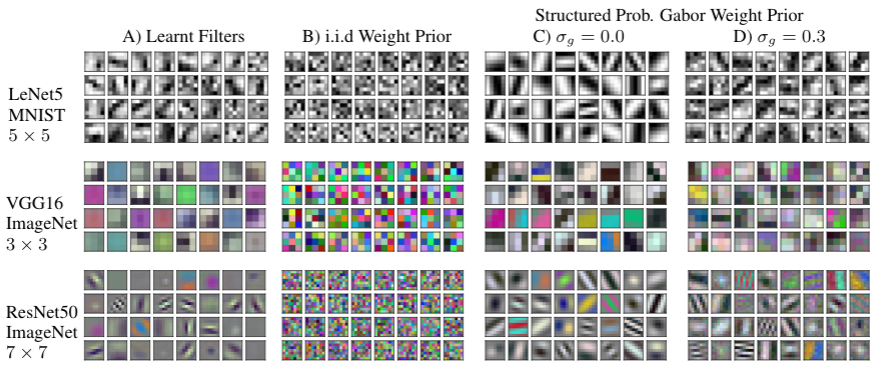

# Structured Weight Priors for Convolutional Neural Networks

Minimal code for the paper:

Structured Weight Priors for Convolutional Neural Networks  <br />
Tim Pearce, Andrew Y. K. Foong, Alexandra Brintrup <br />
ICML workshop, Uncertainty & Robustness in Deep Learning, 2020. <br />



## Code Overview

```
utils.py - general file with most useful stuff

general_entropy_02.py - 4.1 prior predictive diversity
logits_corr_02.py - 4.2 prior activation correlation
tsne_03.py - 4.3 CAPPA
training_curve_02.py - 4.4 training curves

vis_filters_02.py - visualises first layer CNN filters of pretrained models
vis_gabors_02.py - visualises draws from probabilistic Gabor prior
```

## Package Versions

The following package versions were used in developing and running the code. Figures etc are designed to open when run through ipython.
* Python 3.7.0
* Keras version 2.2.4
* Numpy version 1.18.1
* Matplotlib version 3.0.1

## Notice

The purpose of this repo is to provide some depth behind the paper. It's not production ready. Feel free to fork/fix etc, but I won't be actively maintaining/developing/updating this repo, nor responding to minor bugs.


